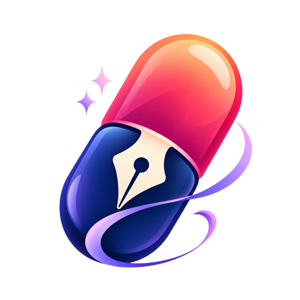

<div align="center">
  
  <h1>Pillole Poetiche</h1>
  <p><strong>Una poesia al giorno, per riscoprire la bellezza delle parole.</strong><br>
  Una raccolta di versi, frasi e pensieri da leggere in pochi secondi.</p>
  <p>
    <a href="https://carellice.github.io/pillole-poetiche/"></a>
  </p>
  <p>
    
    
    
  </p>
</div>

## Cos’è

Pillole Poetiche è una piccola app che raccoglie **144 pillole** — poesie brevi, frammenti e citazioni — di **74 autori**. È pensata per essere aperta un momento, leggere qualcosa di bello e richiuderla.

Non serve registrarsi né installare nulla: si apre dal browser, sul telefono o sul computer.

**👉 [carellice.github.io/pillole-poetiche](https://carellice.github.io/pillole-poetiche/)**

## Come si usa

L’app ha quattro sezioni, raggiungibili dalla barra di navigazione in basso:

| Sezione | Cosa fa |
|---|---|
| **Home** | Mostra *la tua pillola del giorno*: una poesia scelta a caso. Tocca il pulsante di aggiornamento per pescarne un’altra. |
| **Esplora** | Sfoglia tutta la raccolta, in ordine sempre diverso. |
| **Autori** | Elenco degli autori con ritratto e ricerca per nome. Tocca un autore per leggere tutte le sue pillole. |
| **Info** | Due parole sul progetto. |

## Funzionalità

- **Pillola casuale** a ogni apertura e a ogni tocco.
- **Raccolta completa** da sfogliare senza un ordine fisso.
- **Ricerca per autore** con filtro immediato mentre scrivi.
- **Ritratti degli autori** recuperati da Wikipedia, quando disponibili.
- **Interfaccia scura** pensata per il telefono, utilizzabile anche da computer.
- **App Android** generabile dallo stesso codice tramite Capacitor.

> I ritratti degli autori richiedono una connessione a internet; le poesie sono incluse nell’app.

## Avvio in locale

Serve [Node.js](https://nodejs.org/) (consigliata la versione 20).

```bash
npm install
```

```bash
npm start
```

L’app si apre su `http://localhost:3000`.

Per creare la build di produzione nella cartella `build`:

```bash
npm run build
```

## Pubblicazione

Ogni push sul ramo `main` avvia il workflow [deploy-pages.yml](.github/workflows/deploy-pages.yml), che compila il progetto e lo pubblica su GitHub Pages.

## App Android

Il progetto include la configurazione [Capacitor](https://capacitorjs.com/) e le icone Android in `public/android_app_icon`. Servono Android Studio e la CLI di Ionic.

```bash
npm run build
```

```bash
ionic capacitor add android
```

```bash
npx cap open android
```

Dopo aver aperto il progetto in Android Studio, copia le icone da `public/android_app_icon` in `android/app/src/main/res`. Su Windows lo script `npm run build-android` esegue tutti questi passaggi in sequenza. Altri appunti sono in [README.build.android.app.tutorial.txt.txt](README.build.android.app.tutorial.txt.txt).

## Struttura del progetto

```text
src/
├── App.js            # Sezioni dell’app e navigazione
├── components/       # Scheda poesia, esplora, elenco autori, barra in basso
└── utils/
    ├── PoemUtils.js    # La raccolta delle pillole
    └── AuthorUtils.js  # L’elenco degli autori
public/
├── logo512.png         # Logo dell’app
└── android_app_icon/   # Icone per l’app Android
```

## Aggiungere una pillola

1. Se l’autore è nuovo, aggiungilo in [src/utils/AuthorUtils.js](src/utils/AuthorUtils.js).
2. Aggiungi la poesia in [src/utils/PoemUtils.js](src/utils/PoemUtils.js) con titolo, testo e autore:

```js
{
    title: "Titolo dell'opera",
    poem: "Il testo della pillola",
    author: AuthorUtils.NOME_AUTORE
}
```

## Tecnologie

React 18, Material UI, Create React App e Capacitor.

## Crediti

Creato da F.C. per C.C. ❤️

I testi appartengono ai rispettivi autori e sono riportati come brevi citazioni.
